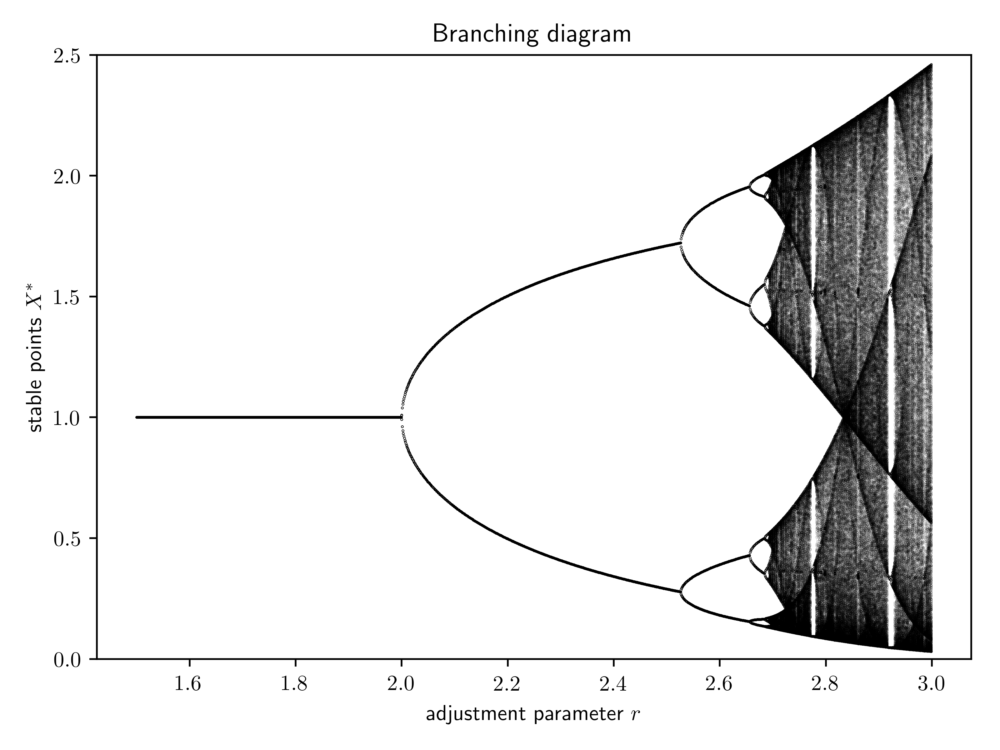

## Bifurcation

* seasonal breeding model: X_t+1 = X_t exp(r(1-X_t))
* bifurcation animated: (evolving with r)
    1. F,F2,F4 against X
    1. population against time
    1. branching diagram

## Files

* `breedModel.py`: a class for generating fixed point data
* `animation.py`: produce bifurcation animations
